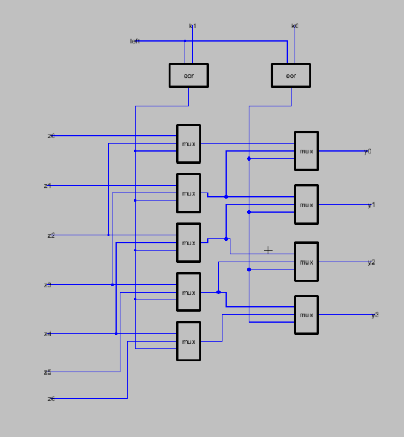

# funnel-shifter

Shifters are very important element which is generally used in microcontroller and microprocessor design for arithmetic shifting, logical shifting and rotation function. A 4 bit shifter is based on multiple levels of small included multiplexers (which can be transmission gates). It include Ex-OR circuit which works as selection control line shifts the word right of left according to the combination provided.

| CIRCUIT | WAVEFORM |
| ------------- | ------------- |
|  |  |
